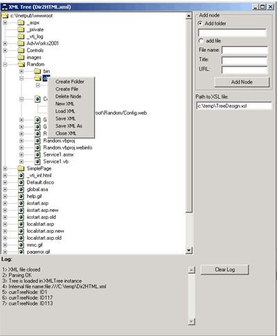



## XML Directory Tree Explorer

### Description

When you use the Dir2XML application (look for other Frodooo postings) it is sometimes useful to modify the exported XML, to create additional directories etc. On the other hand I thought that it might be useful to use the XML/XSL/CSS construction for explorer like trees not coming from a directory structure export. This little application allows you to create contents trees from scratch and to modify existing Dir2XML exports. In addition, the project is based on a XMLTree class. Hope this helps if you wish to adapt the code to your needs.
 
### More Info
 

             |
---                |---
**Submitted On**   |2001-03-19 18:13:10
**By**             |[Frodooo](https://github.com/Planet-Source-Code/PSCIndex/blob/master/ByAuthor/frodooo.md)
**Level**          |Advanced
**User Rating**    |5.0 (10 globes from 2 users)
**Compatibility**  |VB 6\.0
**Category**       |[Internet/ HTML](https://github.com/Planet-Source-Code/PSCIndex/blob/master/ByCategory/internet-html__1-34.md)
**World**          |[Visual Basic](https://github.com/Planet-Source-Code/PSCIndex/blob/master/ByWorld/visual-basic.md)
**Archive File**   |[CODE\_UPLOAD172973192001\.zip](https://github.com/Planet-Source-Code/frodooo-xml-directory-tree-explorer__1-21782/archive/master.zip)

